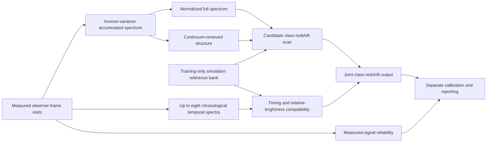

# Architecture

This document describes the reference-based candidate currently under matched
selection evaluation. It is not a performance claim or a frozen release.

## Runtime boundary

The enforced model input is defined by `measurement_inputs` in
[`model/strider.py`](../src/strider/model/strider.py). Required quantities are
measured flux, wavelength coverage, visit coverage and observer-time offsets.
The optional measured quantities are visit flux scale, reported-error shape and
measured peak-date information.

Class labels, true redshift, clean simulated flux, simulated peak date and
truth-derived rest-frame phase remain outside every model call. Training and
evaluation both use the same input filter as deployment.

## Accumulated spectrum

The loader scales each visit independently for numerical stability. Before
combination, [`model/coadd.py`](../src/strider/model/coadd.py) reverses that
scaling and calculates the ordinary inverse-variance accumulated flux and its
propagated uncertainty across all available visits.

The current candidate does not use a broad signal-quality cut. It retains
measured support above a float32 numerical relative-precision floor. This is a
numerical rule, not a redshift-, class- or brightness-dependent selection.

## Spectral comparison

The accumulated spectrum supplies the primary class-redshift evidence. Two
scale-invariant descriptions are compared:

- the normalized full spectrum, retaining broad and local shape; and
- continuum-removed structure, emphasizing localized spectral change.

The relative contribution is learned as a function of candidate redshift. Both
descriptions come from the same measured spectrum and share the same support and
uncertainty-derived reliability.

The 5% cosine edge taper is an influence weight. It is not multiplied into
measured flux or propagated uncertainty. Its exact endpoints have zero matching
influence; other measured bins remain unless they fall below the numerical
precision floor. Reference-bank format `strider-roman-spectral-reference-v3`
prevents an older tapered-flux bank from being loaded silently.

## Simulation-derived reference bank

[`atlas/roman_reference.py`](../src/strider/atlas/roman_reference.py) builds the
fixed bank from clean spectra in the training split only. Training class,
redshift and phase place those spectra on common rest-wavelength and broad-phase
grids. That is supervised reference construction, not a runtime input route.

The bank stores multiple class and phase references, their measured support,
the construction configuration and explicit `truth_used_at_runtime: false`
metadata. Selection, calibration and test objects are not reference material.

## Observation sequence

The candidate uses at most eight chronological temporal spectra. When an object
has more, the observation sequence is divided into chronological blocks and one
visit is selected from each using measured median signal-to-noise. This preserves
coverage across the history rather than taking only the earliest or strongest
visits.

For every candidate redshift, observer intervals become candidate rest-frame
intervals through `dt / (1 + z)`. STRIDER compares broad phase-indexed reference
histories while marginalizing the unknown starting phase. The temporal
Transformer also receives uncertainty-weighted relative brightness after one
object-wide scale is removed. The configured candidate does not expose the
visit signal-to-noise statistic as a learned class-redshift feature.

## Outputs and calibration

The spectral and temporal components return separate diagnostics and one joint
class-redshift surface. The normalized joint distribution is the basis for class
probabilities and the redshift posterior.

Calibration remains a separate post-training operation on the reserved
calibration split:

1. class-probability calibration;
2. redshift coverage sets, which may be disconnected; and
3. measured-signal reliability calibrated against matched source and blank
   observations.

Raw results remain available. Calibration never rewrites the fitted model or
turns measured-signal reliability into redshift confidence.

## Current status

The frozen calibrated STRIDER baseline remains the verified comparison. The
reference architecture is undergoing a corrected two-epoch selection gate. It
must not be described as superior, final or production-ready until matched
selection results are reviewed. Only then may the procedure be frozen,
calibration fitted and the untouched final test opened.
