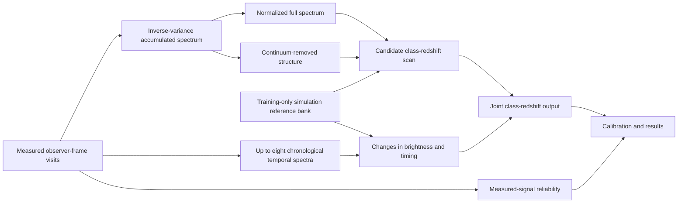

# STRIDER model

STRIDER compares measured spectra with a simulation-derived reference bank
to estimate transient class and redshift jointly. The model is being updated
and tested.

## Inputs

The input fields are defined by `measurement_inputs` in
[`model/strider.py`](../src/strider/model/strider.py). Required quantities are
measured flux, wavelength coverage, visit coverage and observer-time offsets.
The optional measured quantities are visit flux scale, reported-error shape and
measured peak-date information.

Class labels, true redshift, clean simulated flux, simulated peak date and
truth-derived rest-frame phase remain outside every model call. Training and
evaluation both use the same input filter as deployment.

## Accumulated spectrum

The loader scales each visit independently for numerical stability. Before
combination, [`model/coadd.py`](../src/strider/model/coadd.py) reverses that
scaling and calculates the ordinary inverse-variance accumulated flux and its
propagated uncertainty across all available visits.

Measured wavelength bins are retained above a float32 relative-precision
threshold. This threshold protects the numerical calculation; there is no
additional fixed signal-to-noise cut.

## Spectral comparison

The accumulated spectrum supplies the primary class-redshift evidence. Two
scale-invariant descriptions are compared:

- the normalized full spectrum, retaining broad and local shape; and
- continuum-removed structure, emphasizing localized spectral change.

The relative contribution is learned as a function of candidate redshift. Both
descriptions come from the same measured spectrum and share the same support and
uncertainty-derived reliability.

The 5% cosine edge taper is an influence weight. It is not multiplied into
measured flux or propagated uncertainty. Its exact endpoints have zero matching
influence; other measured bins remain unless they fall below the numerical
precision floor. Reference-bank format `strider-roman-spectral-reference-v3`
is required when loading the bank. Check its construction settings and checksum
against the model package.

## Simulation-derived reference bank

[`atlas/roman_reference.py`](../src/strider/atlas/roman_reference.py) builds the
fixed bank from clean spectra in the training split only. Training class,
redshift and phase place those spectra on common rest-wavelength and broad-phase
grids. These labels are used to build the reference bank only.

The bank stores multiple class and phase references, their measured support,
the construction configuration digest and explicit `truth_used_at_runtime: false`
metadata. Archive the full construction configuration and source manifests
separately. Selection, calibration and test objects are not reference material.

## Observation sequence

The model uses up to eight spectra to describe how the transient changes over
time. For longer sequences, the sorted visit indices are divided into eight
blocks. The spectrum with the highest measured median signal-to-noise is
selected from each block.

For every candidate redshift, observer intervals become candidate rest-frame
intervals through `dt / (1 + z)`. STRIDER compares broad phase-indexed reference
sequences and combines the results over possible starting phases. The temporal
Transformer also receives uncertainty-weighted relative brightness after one
object-wide scale is removed. The configured candidate does not expose the
visit signal-to-noise statistic as a learned class-redshift feature.

## Outputs and calibration

The spectral and temporal components return separate diagnostics and one joint
class-redshift surface. The normalized joint distribution is the basis for class
probabilities and the redshift posterior.

Calibration remains a separate post-training operation on the reserved
calibration split:

1. class-probability calibration;
2. redshift coverage sets, which may be disconnected; and
3. signal reliability calibrated using source and noise-only observations
   with matching observation properties.

Raw results remain available. Calibration never rewrites the fitted model or
turns measured-signal reliability into redshift confidence.

## Current status

A supported trained model package will be provided after model selection,
calibration and final evaluation. The implementation issues below are being
reviewed as part of that work.

## Known limitations

The following issues are being checked before a trained model is released:

- Data preparation can reject measured values because the corresponding
  clean simulated values are not finite.
- Preparation and inference can treat gaps in wavelength coverage differently.
- Changing how training batches are divided can change the class-weighted
  gradient.
- Relative-brightness normalization can underflow for very small float32 fluxes.
- Continuum removal can create a residual in a constant spectrum where the
  relative precision is low.
- When no class-redshift trial has valid wavelength support, the result still
  contains a fallback distribution without flagging that condition.
