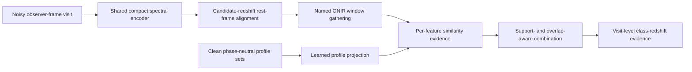

# Phase-neutral ONIR local results — 2026-08-02

> **Historical research record:** This page preserves an earlier experiment or
> decision. It does not define the current STRIDER tool. See
> [`architecture.md`](architecture.md) for the current design.

## Question

Can a clean, understandable ONIR redshift scan recover physical spectral
information without receiving rest-frame phase, observer dates, or the simulated
error spectrum?

This is a local development test, not a final accuracy measurement. The model is
binary (normal Ia versus all other types), uses 1,200 training, 300 validation,
and 500 held-out test objects, and has only 771 trainable parameters.

## What was implemented

The bank builder uses only training-split objects. It aligns spectra offline with
the simulation redshift, pools all available phases, and records support for every
class and feature. Inference receives observer-frame flux and a wavelength mask.
For each trial redshift it:

1. shifts the measured spectrum onto a candidate rest-frame grid;
2. gathers velocity-aware windows around 15 named wavelengths;
3. compares each window with a phase-neutral class profile by cosine similarity;
4. downweights overlapping windows;
5. combines only features and visits that are actually measured; and
6. returns one joint class-redshift score array.

The branch never reads visit dates. It does not use class-specific feature masks,
does not fill missing phase cells, and does not receive `FLAMERR`.

The clean bank uses `SIM_FLAM` only during offline profile construction. Training
and inference still use noisy observation views. A second bank was built from
training-split `FLAM` for a controlled comparison.

## Bank audit

- 15 named rest wavelengths, two local classes, one phase-neutral mean and one
  medoid per class-feature cell.
- All 30 cells are supported; none are empty or based on one window.
- Support ranges from 1,659 to 5,520 training windows per cell.
- Adjacent feature windows overlap by 0.578 on average and 0.923 at maximum.
  Explicit overlap weights are therefore required.
- Depending on trial redshift, 2 to 15 feature centres are in the local
  7,500–20,000 Å observed band. Window validity is measured separately from centre
  visibility during inference.
- The mean cosine similarity between the clean and observed-profile banks is high;
  the median across 30 cells is 0.918, with a range of 0.155 to 0.999.

## Held-out results

All redshift quantities below are raw \(\Delta z=z_{pred}-z_{true}\). The outlier
threshold is \(|\Delta z|>0.1\). Each row contains the same 500 test objects.

### Generated noisy spectra

| ONIR arm | Class accuracy | Median \(|\Delta z|\) | Population scatter | Outlier fraction | 68% interval coverage |
|---|---:|---:|---:|---:|---:|
| Named clean mean profiles | 0.558 | 0.668 | 1.100 | 0.736 | 0.888 |
| Named clean medoids | 0.548 | 0.634 | 1.088 | 0.724 | 0.886 |
| Named observed-FLAM means | 0.566 | 0.744 | 1.183 | 0.754 | 0.886 |
| Locally randomized positions | 0.536 | 0.673 | 1.062 | 0.726 | 0.878 |
| Random profiles at named positions | 0.570 | 1.031 | 1.332 | 0.866 | 0.882 |
| Equal-weight coadded input | 0.546 | 0.727 | 1.195 | 0.744 | 0.872 |

The paired bootstrap difference in median absolute redshift error relative to the
named clean mean is:

- medoid: −0.035, 95% interval [−0.097, +0.010];
- observed-FLAM mean: +0.076, [0.000, +0.183];
- locally randomized position: +0.005, [−0.103, +0.121];
- random profile: +0.363, [+0.259, +0.513];
- coadded input: +0.059, [−0.062, +0.171].

Only the random-profile degradation is decisive in the overall sample. The other
overall comparisons remain too small or variable for a firm ranking.

### Clean spectra

| ONIR arm | Class accuracy | Median \(|\Delta z|\) | Population scatter | Outlier fraction |
|---|---:|---:|---:|---:|
| Named clean mean profiles | 0.770 | 0.021 | 0.625 | 0.346 |
| Named clean medoids | 0.748 | 0.022 | 0.653 | 0.362 |
| Named observed-FLAM means | 0.552 | 0.025 | 0.698 | 0.410 |
| Locally randomized positions | 0.770 | 0.021 | 0.469 | 0.286 |
| Random profiles at named positions | 0.702 | 0.413 | 0.978 | 0.598 |
| Equal-weight coadded input | 0.676 | 0.036 | 1.008 | 0.490 |

The clean result establishes that the named profiles and redshift scan can recover
the physical signal. It also shows that replacing the learned spectral shapes with
random profiles removes most of that ability.

### Exact locations by redshift

The locally randomized control draws one position inside each named feature's local
wavelength interval. It therefore preserves broad detector coverage better than a
uniform random draw. Its generated-spectrum comparison is mixed:

| True-redshift group | N | Named median \(|\Delta z|\) | Random-position median \(|\Delta z|\) | Random minus named, paired 95% interval |
|---|---:|---:|---:|---:|
| 0.00–0.75 | 100 | 0.026 | 0.025 | −0.001 [−0.163, +0.070] |
| 0.75–1.25 | 100 | 0.733 | 0.472 | −0.261 [−0.582, −0.017] |
| 1.25–1.75 | 100 | 1.151 | 0.828 | −0.323 [−0.530, −0.037] |
| 1.75–2.25 | 100 | 0.885 | 1.114 | +0.229 [+0.042, +0.619] |
| 2.25–3.10 | 100 | 0.562 | 1.851 | +1.289 [+0.758, +1.622] |

The exact named positions strongly protect the high-redshift scan, but the present
catalogue is not optimal across the whole range. A full comparison needs several
random-position seeds and more objects before making a general interpretability
claim.

### No-source and residual controls

| ONIR arm | No-source fraction within \(\Delta z=0.1\) of simulation value | Residual fraction within \(\Delta z=0.1\) | Mean largest residual joint probability |
|---|---:|---:|---:|
| Named clean mean profiles | 0.030 | 0.038 | 0.031 |
| Named clean medoids | 0.028 | 0.038 | 0.031 |
| Named observed-FLAM means | 0.022 | 0.024 | 0.033 |
| Locally randomized positions | 0.022 | 0.026 | 0.028 |
| Random profiles | 0.030 | 0.016 | 0.030 |
| Equal-weight coadded input | 0.030 | 0.042 | 0.096 |

The direct ONIR branch does not recover the earlier residual-only redshift
recovery. Coadding does not improve source accuracy and triples the largest joint
probability on residuals, so it should not replace visit-level evidence.

## Decisions

1. Keep the clean training-only bank as the default reference. Retain the FLAM bank
   as a diagnostic; it did not improve held-out noisy or original observations.
2. Keep named rest wavelengths. Exact positions are especially important at high
   redshift, but feature selection and widths should be optimized with multiple
   random controls across the complete range.
3. Keep physical profile initialization. Random profiles failed decisively in this
   small-data run.
4. Treat mean versus medoid as unresolved. Multiple phase-neutral prototypes are a
   better next test than choosing one global representative.
5. Do not use coadded spectra as a replacement path. Later test a small, separately
   exposed coadded context term beside visit evidence, with no error-based weighting.
6. Do not promote this raw-flux matcher as the final model. Its clean performance is
   strong, but it lacks the learned denoising and local representation needed for
   noisy spectra.

## Next architecture

The next branch should preserve this tested gather and support logic while moving
matching into a compact learned spectral space:

Use two to four phase-neutral profiles per class-feature cell, learned from clean
training windows without phase labels. The model may refine them under an explicit
drift penalty. Keep the raw-profile branch as a diagnostic and require the same
clean, no-source, residual, independent-noise, and random-position tests.
